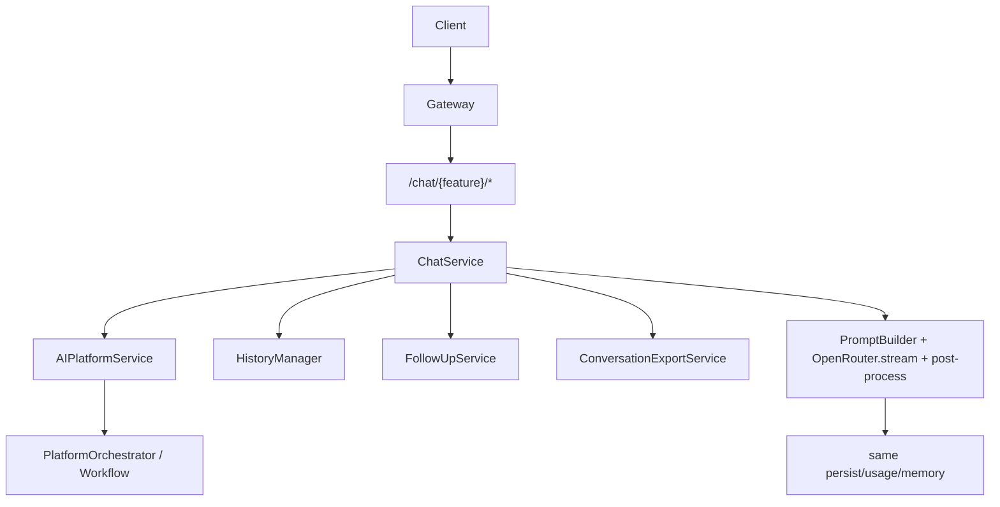

# Conversation Chat API (Sprint C)

Sprint C adds a ChatGPT-style conversational façade at `/chat/{feature}/*` on top of the existing single-LLM AI platform. Existing product routes (`/leetcode`, `/hackerrank`, `/courses`, `/dsa-pattern`, `/ai`) are unchanged.

## Architecture



## Features

Supported `{feature}` slugs:

- `leetcode`
- `hackerrank`
- `dsa_pattern`
- `course_generator`

`interview` is accepted by the path enum for OpenAPI visibility but **returns HTTP 501** — Interview Trainer remains scaffold-only and out of scope.

## Endpoints

| Method | Path | Purpose |
|--------|------|---------|
| POST | `/chat/{feature}/stream` | SSE chat with status + token streaming |
| POST | `/chat/{feature}/continue` | Continue truncated output |
| POST | `/chat/{feature}/retry` | Retry failed assistant turn |
| POST | `/chat/{feature}/regenerate` | Regenerate assistant message |
| POST | `/chat/{feature}/follow-up` | Natural follow-up alias |
| GET | `/chat/{feature}/sessions` | List sessions (pagination, search) |
| GET | `/chat/{feature}/sessions/{session_id}` | Session detail + messages |
| PATCH | `/chat/{feature}/sessions/{session_id}/rename` | Rename session |
| PATCH | `/chat/{feature}/sessions/{session_id}/archive` | Archive / restore |
| PATCH | `/chat/{feature}/sessions/{session_id}/pin` | Pin / unpin |
| DELETE | `/chat/{feature}/sessions/{session_id}` | Delete session |
| POST | `/chat/{feature}/export` | Export markdown/json/txt/pdf |
| PATCH | `/chat/{feature}/messages/{message_id}/bookmark` | Bookmark message |
| DELETE | `/chat/{feature}/messages/{message_id}` | Soft-delete message |

Gateway proxies `/chat/*` and `/interview/*` to the AI service.

## Streaming flow

### Dual streaming contract

| Path | Behavior |
|------|----------|
| `POST /chat/{feature}/stream` | **Token SSE** — status phases + token deltas + `complete` + `done`; cancel + `Last-Event-ID` reconnect |
| Product routes (`/leetcode/analyze`, `/hackerrank/analyze`, `/dsa-pattern/generate`, `/courses/generate`) with `?stream=true` | **Coarse SSE** — status / problem markdown / complete wrappers (not token deltas) |

Prefer the chat façade for ChatGPT-style token streaming.

1. Client `POST /chat/{feature}/stream` with `Accept: text/event-stream` (or `?stream=true` via gateway).
2. Server runs planner → builds prompts → streams OpenRouter tokens.
3. After stream completes, the existing normalize → processors → persist path runs.
4. Final structured payload is emitted as a `complete` event.
5. Assistant `content_metadata` is updated on the stream path with the same fields used by retry/regenerate.

### SSE lifecycle (Sprint C.1)

Every stream ends with `done`. On success:

`thinking` → `preparing` → `generating` → `explaining` → `evaluating` → `complete` → `done`

On error or client disconnect:

`thinking` → … → `error` → `done`

### Streaming cancellation (Sprint C.1)

When the browser disconnects, the client closes the tab, or the user presses Stop:

- The router passes `request.is_disconnected` as `cancel_check` into the workflow stream.
- OpenRouter streaming stops immediately.
- Downstream post-LLM processing is skipped.
- Incomplete assistant messages created during the stream are rolled back.
- The SSE stream emits `error` then `done` (no hanging connection).

### Reconnect / resume

SSE frames include incremental `id:` lines. Clients may reconnect with `Last-Event-ID`.

- If the session already has a persisted assistant turn (`status` completed/truncated or structured metadata), the server emits `status=reconnect` then a `complete` payload reconstructed from that message, then `done`.
- Otherwise it emits `status=reconnect` with detail `incomplete; retry stream` and `done`, so the client can start a fresh stream (or call `/retry`).

### SSE event schema

```json
{"type":"status","status":"thinking"}
{"type":"status","status":"preparing"}
{"type":"status","status":"generating"}
{"type":"token","delta":"partial text"}
{"type":"status","status":"explaining"}
{"type":"status","status":"evaluating"}
{"type":"complete","response":{...ChatResponse...}}
{"type":"done"}
{"type":"error","message":"reason"}
```

Status values: `thinking`, `preparing`, `generating`, `explaining`, `evaluating`, `practice`, `complete`, `error`, `reconnect`.

## Continue flow (Sprint C.1)

- `POST /chat/{feature}/continue` with `session_id` and optional `message_id`.
- Locates the latest truncated assistant message (or the explicit `message_id`).
- Reads persisted `finish_reason`, `missing_sections`, and `status` from `content_metadata`.
- Generates **only** the missing sections via `requested_sections` + `prior_llm_raw`.
- Merges new structured output into the existing truncated message.
- Never regenerates completed sections and never leaves duplicate assistant rows (a new partial row is deleted after merge when needed).

## Retry flow

- `POST /chat/{feature}/retry` with `session_id` + `message_id`.
- Resolves the preceding user message and re-runs the same chat turn in the same session.
- Failed assistant message remains in history for audit.

## Regenerate flow

- `POST /chat/{feature}/regenerate` with `session_id` + `message_id`.
- Marks the target assistant message `status=superseded` in `content_metadata`.
- Generates a fresh assistant message with `regenerated_from_message_id` metadata.

## Export (Sprint C.1)

`POST /chat/{feature}/export`

```json
{
  "session_id": "uuid",
  "format": "markdown",
  "export_type": "conversation"
}
```

Formats: `markdown`, `json`, `txt`, `pdf`.

Export types: `conversation`, `solution`, `course`, `pattern`, `interview_report`.

Exports load the **full session** from the database (`list_all_by_session`), not the first page of messages. Deleted, superseded, and failed messages are excluded unless you fetch session detail with `include_hidden=true` first (export always uses visible messages).

## Session management

`ai_sessions` fields:

- `is_archived` — hidden from default session lists
- `is_pinned` — sorted first
- `last_active_at` — updated on every chat action

`GET /chat/{feature}/sessions/{session_id}` supports:

- `limit` / `offset` — message pagination
- `include_hidden` — when `true`, returns deleted, superseded, and failed messages
- `total_messages` — full database count for the session (not page size)

Message `content_metadata` chat fields:

- `status`: `completed | failed | truncated | superseded`
- `action`: `stream | continue | retry | regenerate | follow_up`
- `generation_type`, `retry_count`, `cache_hit`
- `finish_reason`, `missing_sections`, `requested_sections`
- `supersedes_message_id`, `regenerated_from_message_id`
- `prompt_version`, `model`, `provider`
- `prompt_tokens`, `completion_tokens`, `total_tokens`, `section_tokens`, `execution_time_ms`
- `structured`, `bookmarked`, `deleted`

## Token efficiency

Continue, follow-up, and partial regenerate paths reuse session memory and prior structured output. Full regeneration only occurs when explicitly requested via `/regenerate` or `requested_sections` on stream requests.
